```markdown
Librería para el uso en Validación de Datos para Formularios Universitarios

* Nombre del Alumno: Yareli Yazmin Pacheco Aragón
* Semestre: Sexto Semestre Grupo: B 
* Carrera: Ingeniería en Sistemas Computacionales
* Materia: Programación Web

¿Qué problema resuelve este proyecto?
Este proyecto resuelve la validación y consistencia de datos en el lado del cliente para un formulario tipo de control escolar universitario. A través de JavaScript, la librería verifica los datos proporcionados por el estudiante, asegurando que los datos escolares cumplan con las reglas de negocio de la institución desde el navegador del usuario.


Instalación
Para integrar esta librería en cualquier documento HTML de la plataforma, se debe almacenar el archivo en el directorio correspondiente de scripts e importarlo al final del cuerpo del documento, asegurando su carga antes del script principal:

```html
<script src="js/utileria.js"></script>

```

Uso y Ejemplos de Código

Funciones Obligatorias

#### 1. validarCorreo(correo)

Comprueba si el correo electrónico ingresado cumple con una estructura estándar mediante expresiones regulares.

```javascript
function validarCorreo(correo) {
    var expresion = /^[^\s@]+@[^\s@]+\.[^\s@]+$/;
    return expresion.test(correo); 
}

// Ejemplo ya implementado:
var correoInput = "yareli@correo.com";
if (!validarCorreo(correoInput)) {
    console.log("Error: El formato del correo electrónico es incorrecto.");
} else {
    console.log("Validación exitosa: Correo estructurado correctamente.");
}

```

#### 2. soloLetras(texto)

Filtra cadenas de texto para asegurar que contengan únicamente letras (mayúsculas o minúsculas), espacios y caracteres acentuados o la letra ñ.

```javascript
function soloLetras(texto) {
    var expresion = /^[a-zA-ZáéíóúÁÉÍÓÚñÑ\s]+$/;
    return expresion.test(texto);
}

// Ejemplo ya implementado:
var nombreInput = "Yareli Yazmin";
if (!soloLetras(nombreInput)) {
    alert("El campo nombre solo acepta letras, acentos y espacios.");
}

```

#### 3. validarLongitud(numero, maxLongitud)

Convierte un valor numérico a tipo String y evalúa si su cantidad de dígitos es menor o igual al límite máximo permitido.

```javascript
function validarLongitud(numero, maxLongitud) {
    var cadenaNumero = String(numero);
    return cadenaNumero.length <= maxLongitud;
}

// Ejemplo ya implementado:
var codigoEstudiante = 12345;
if (!validarLongitud(codigoEstudiante, 5)) {
    console.error("El código numérico supera el límite de 5 caracteres.");
}

```

#### 4. calcularEdad(fechaNacimiento)

Calcula de forma exacta la edad de una persona restando el año de nacimiento al año actual y ajustando el resultado si la persona no ha cumplido años en el mes en curso.

```javascript
function calcularEdad(fechaNacimiento) {
    var hoy = new Date(); 
    var cumpleanos = new Date(fechaNacimiento);
    
    var edad = hoy.getFullYear() - cumpleanos.getFullYear();
    var diferenciaMeses = hoy.getMonth() - cumpleanos.getMonth();
  
    if (diferenciaMeses < 0 || (diferenciaMeses === 0 && hoy.getDate() < cumpleanos.getDate())) {
        edad--;
    }
    return edad; 
}

// Ejemplo ya implementado:
var edadCalculada = calcularEdad("2002-05-15");
console.log("Resultado matemático: El alumno tiene " + edadCalculada + " años.");

```

#### 5. esMayorDeEdad(fechaNacimiento)

Determina si la fecha de nacimiento ingresada corresponde a un usuario con 18 años o más apoyándose en la función de cálculo de edad.

```javascript
function esMayorDeEdad(fechaNacimiento) {
    var edadCalculada = calcularEdad(fechaNacimiento);
    return edadCalculada >= 18; 
}

// Ejemplo ya implementado:
var fechaInput = "2002-05-15";
if (esMayorDeEdad(fechaInput)) {
    console.log("Estatus verificado: Mayor de edad habilitado para el padrón escolar.");
}

```

#### 6. validarPassword(password)

Evalúa que la contraseña cumpla con criterios de seguridad: mínimo 8 caracteres, una mayúscula, una minúscula, un número y un carácter especial.

```javascript
function validarPassword(password) {
    var expresion = /^(?=.*[A-Z])(?=.*[a-z])(?=.*[0-9])(?=.*[!@#$%^&*(),.?":{}|<>]).{8,}$/;
    return expresion.test(password);
}

// Ejemplo ya implementado:
var passInput = "Sistemas2026#";
if (!validarPassword(passInput)) {
    alert("La contraseña debe incluir mayúsculas, minúsculas, números y caracteres especiales.");
}

```

### Otras Funciones Implementadas

#### 1. validarCURP(curp)

* Transforma la cadena a mayúsculas y valida que la CURP cumpla con el formato estructural oficial de 18 caracteres.

```javascript
function validarCURP(curp) {
    var expresion = /^[A-Z]{4}\d{6}[HM][A-Z]{5}[A-Z0-9]\d$/;
    return expresion.test(curp.toUpperCase());
}

// Ejemplo ya implementado:
var curpInput = "PAAY020515HOCRRR01";
if (!validarCURP(curpInput)) {
    alert("La estructura de la CURP ingresada es inválida.");
}

```

#### 2. validarSemestre(anioIngreso, semestreActual)

* Aplica una regla de consistencia temporal en JavaScript. Evalúa la diferencia entre el año actual (2026) y el año de ingreso del alumno para determinar el límite máximo de semestres que ha podido cursar de forma lógica (máximo 2 semestres por año físico más un margen de tolerancia).

```javascript
function validarSemestre(anioIngreso, semestreActual) {
    var anioActual = 2026; 
    var semestre = parseInt(semestreActual);
    var ingreso = parseInt(anioIngreso);

    if (semestre < 1 || semestre > 12) return false;
    var aniosTranscurridos = anioActual - ingreso;
    if (aniosTranscurridos < 0) return false;

    var maxSemestrePosible = (aniosTranscurridos * 2) + 2;
    return semestre <= maxSemestrePosible;
}

// Ejemplo ya implementado:
if (!validarSemestre(2025, 8)) {
    alert("Error lógico: Un alumno que ingresó en 2025 no puede cursar el 8vo semestre en 2026.");
}

```

#### 3. validarHorarioEscolar(horaInicio, horaFin)

* Convierte las cadenas de tiempo a minutos absolutos para asegurar que el horario pertenezca a la jornada universitaria (07:00 a 20:00 hrs) y que la hora de salida no sea previa a la de entrada.

```javascript
function validarHorarioEscolar(horaInicio, horaFin) {
    if (!horaInicio || !horaFin) return false;

    var partesInicio = horaInicio.split(":");
    var partesFin = horaFin.split(":");
    
    var minutosInicio = parseInt(partesInicio[0]) * 60 + parseInt(partesInicio[1]);
    var minutosFin = parseInt(partesFin[0]) * 60 + parseInt(partesFin[1]);

    var limiteInferior = 7 * 60;   
    var limiteSuperior = 20 * 60;  

    if (minutosInicio >= minutosFin) return false;
    if (minutosInicio < limiteInferior || minutosFin > limiteSuperior) return false;

    return true;
}

// Ejemplo ya implementado:
if (!validarHorarioEscolar("08:00", "13:00")) {
    alert("Horario escolar rechazado por inconsistencia de horas o desfase de turno.");
}

```

#### 4. validarPesoArchivo(archivoObjeto, maxMB)

* Accede directamente a la propiedad de tamaño binario del archivo seleccionado para verificar que no sobrepase el peso en Megabytes configurado.

```javascript
function validarPesoArchivo(archivoObjeto, maxMB) {
    if (!archivoObjeto) return false;
    
    var pesoEnBytes = archivoObjeto.size;
    var pesoEnMB = pesoEnBytes / (1024 * 1024); 

    return pesoEnMB <= maxMB; 
}

// Ejemplo ya implementado:
var inputDocumento = document.getElementById("cargaAcademica").files[0];
if (!validarPesoArchivo(inputDocumento, 2)) {
    alert("El archivo PDF de la carga académica excede el tamaño límite de 2 MB.");
}

```


## Capturas de Pantalla (Consola mostrando resultados)

*Login

* validarCorreo: 
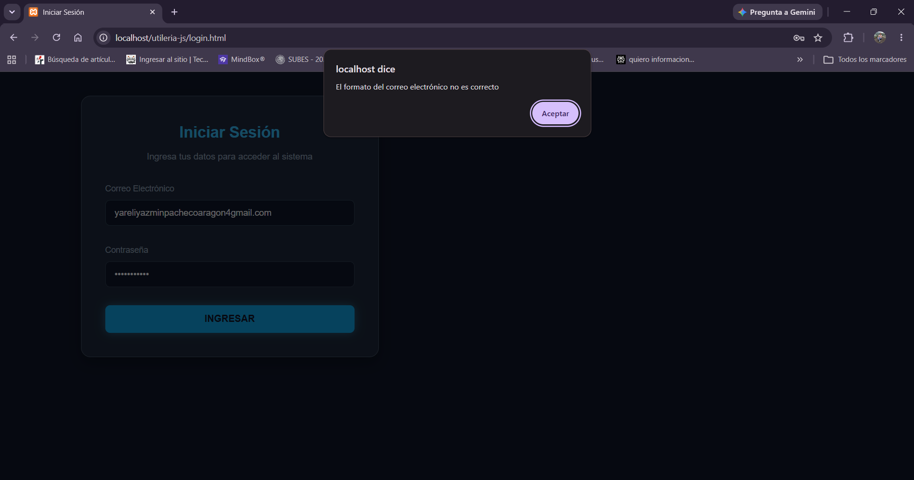

Prueba de validación de correo electrónico. Al ingresar un correo sin el símbolo @, el sistema detecta que el formato es incorrecto, muestra una alerta al usuario y guarda el registro del error en la consola de JavaScript. 

* validarPassword:

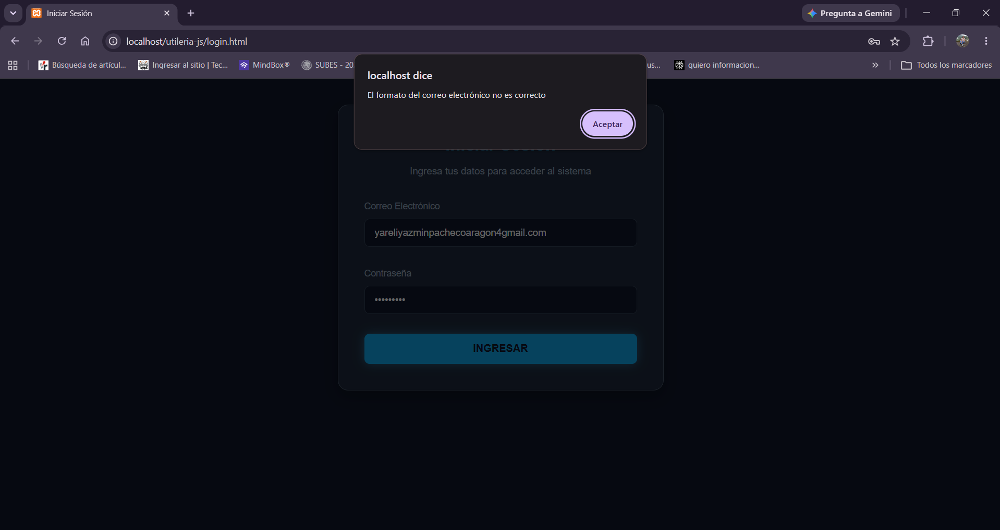
Prueba de validación de contraseña segura. Al ingresar una contraseña que no cumple con los requisitos,  el sistema detecta que el formato es incorrecto, muestra una alerta al usuario y guarda el registro del error en la consola de JavaScript.

* Los datos son correctos: 
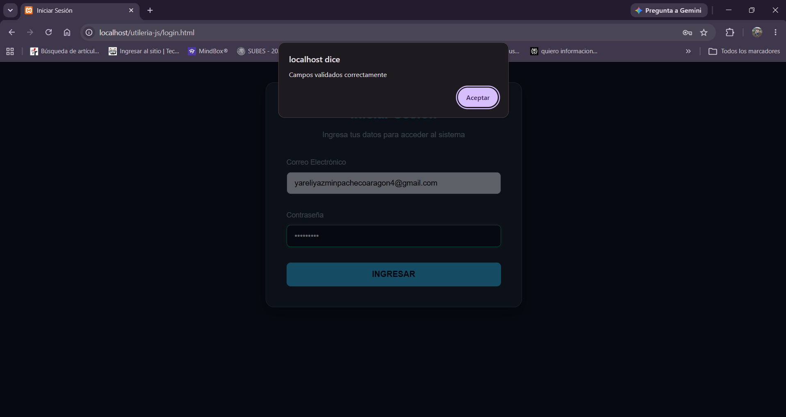
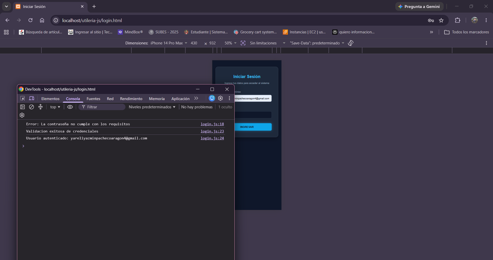
Prueba de inicio de sesión exitoso. Al ingresar un correo electrónico y una contraseña válidos que cumplen con todos los requisitos de seguridad establecidos, el sistema procesa las credenciales correctamente, confirma la validación y genera el registro de usuario autenticado en la consola de JavaScript.


* validarCamposObligatorios:

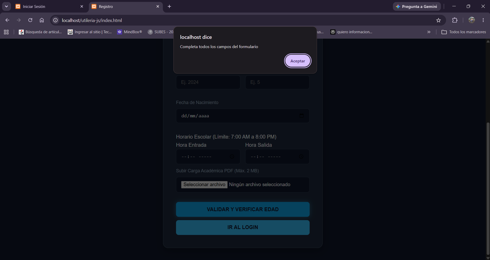
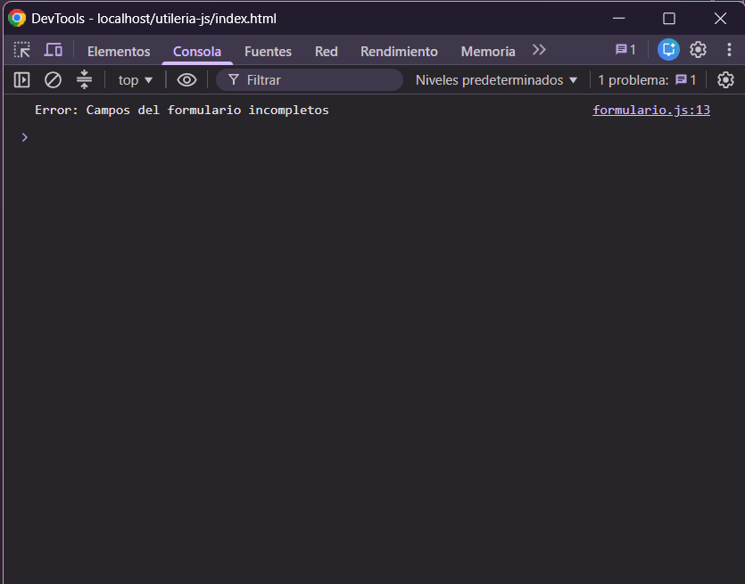

Prueba de validación de campos vacíos. Al presionar el botón sin llenar todos los inputs obligatorios del formulario, el sistema detecta que el formato es incorrecto, muestra una alerta al usuario y guarda el registro del error en la consola de JavaScript. 

* validarNombre:
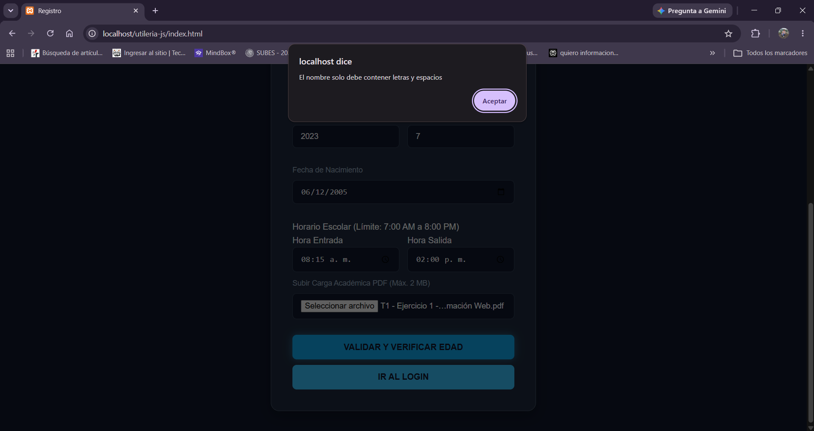
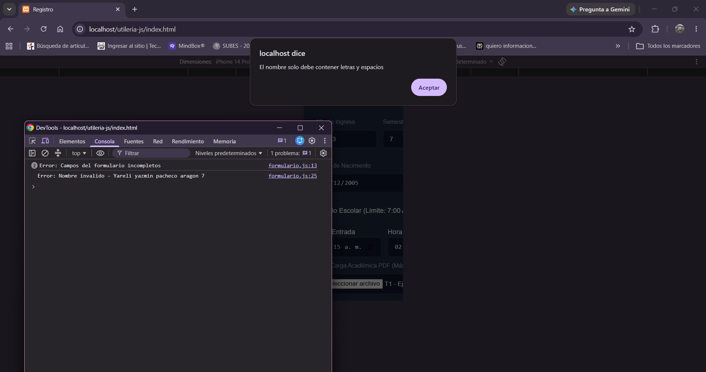

Prueba de validación de nombre. Al ingresar un nombre con números o caracteres no permitidos, el sistema detecta que el formato es incorrecto, muestra una alerta al usuario y guarda el registro del error en la consola de JavaScript.

* validarCodigo:

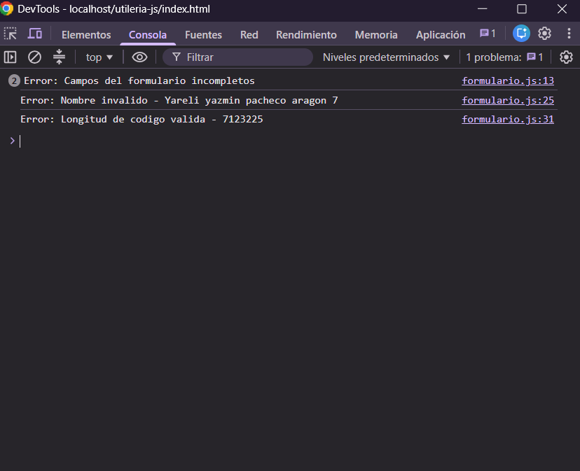
Prueba de validación de código numérico. Al ingresar un código que supera el límite de 5 dígitos establecido, el sistema detecta que el formato es incorrecto, muestra una alerta al usuario y guarda el registro del error en la consola de JavaScript.

* validarCURP:
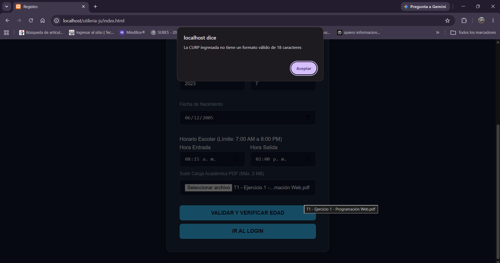
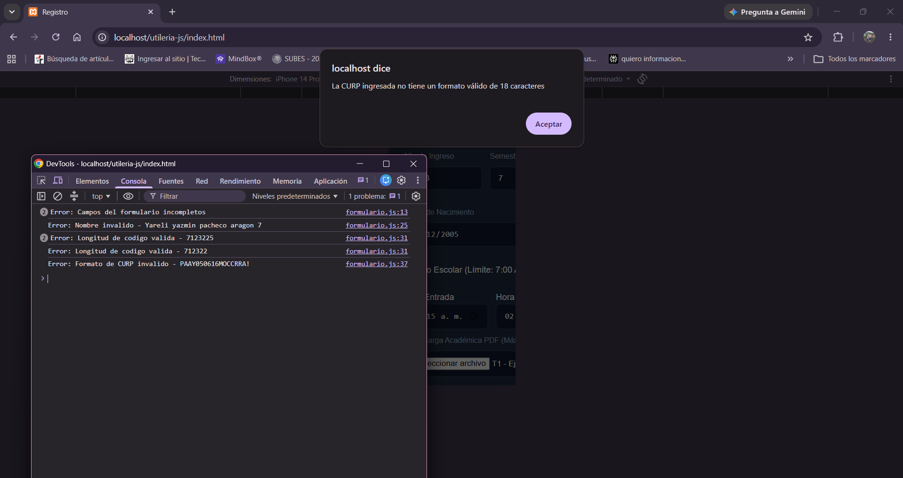
Prueba de validación de CURP. Al ingresar una CURP que no cumple con el formato requerido de 18 caracteres, el sistema detecta que el formato es incorrecto, muestra una alerta al usuario y guarda el registro del error en la consola de JavaScript.

* validarSemestre:

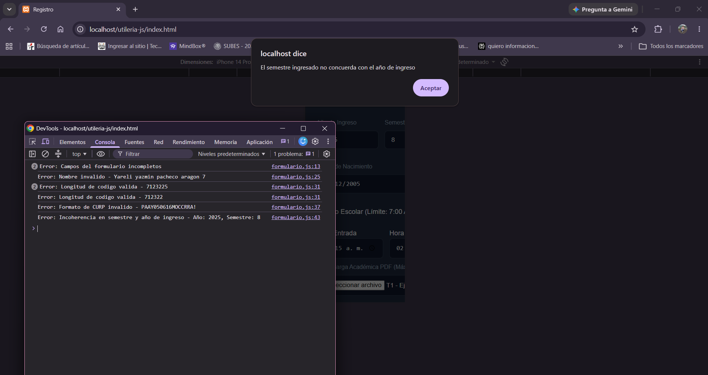
Prueba de validación de congruencia escolar. Al ingresar un semestre que no concuerda lógicamente con el año de ingreso, el sistema detecta que el formato es incorrecto, muestra una alerta al usuario y guarda el registro del error en la consola de JavaScript.

+ validarHorarioEscolar:
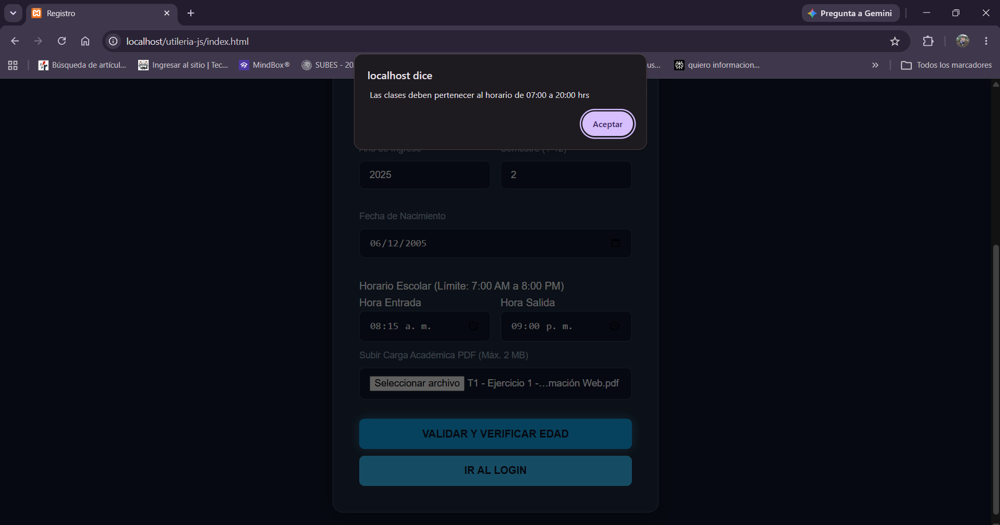
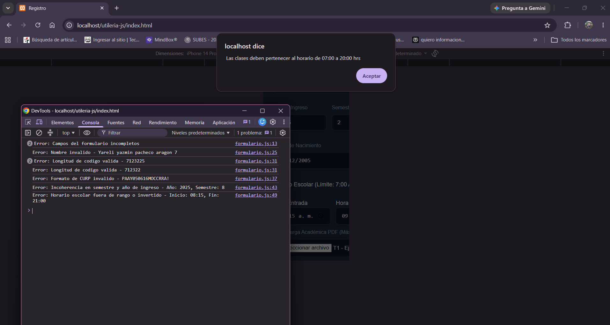
Prueba de validación de límites de horario escolar. Al ingresar una hora de entrada o salida que se encuentra fuera del rango permitido (07:00 a 20:00 hrs), el sistema detecta que el formato es incorrecto, muestra una alerta al usuario y guarda el registro del error en la consola de JavaScript.

* validarTamanoArchivo:
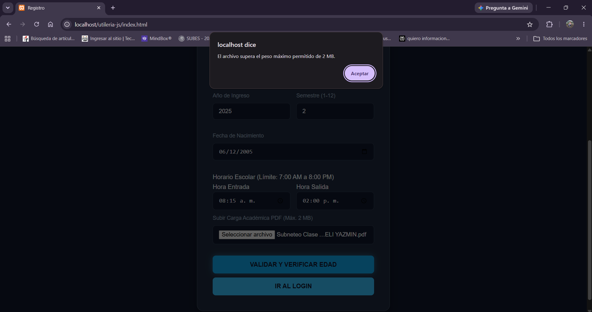
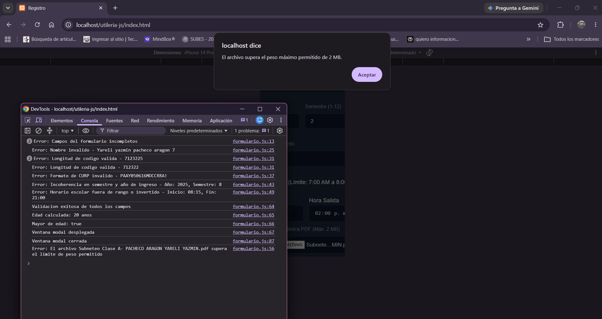
Prueba de validación de tamaño de archivo. Al cargar un documento PDF que supera el límite máximo establecido de 2 MB, el sistema detecta que el peso es incorrecto, muestra una alerta al usuario y guarda el registro del error en la consola de JavaScript. 

* Los datos son correctos: 
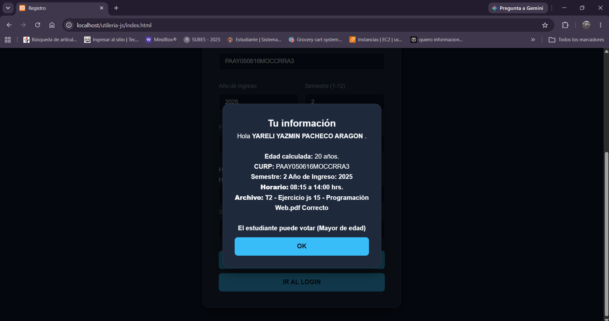
Prueba de validación exitosa. Al ingresar correctamente todos los campos obligatorios con formatos válidos y coherentes, el sistema procesa la información de manera correcta y despliega una ventana modal con el resumen de los datos del estudiante. 

## Demostracion en Video 

https://drive.google.com/drive/folders/1IVO0dJXtrxiqfOfqzKfB2sr-8UgIFBPp?usp=sharing 

---


```

```